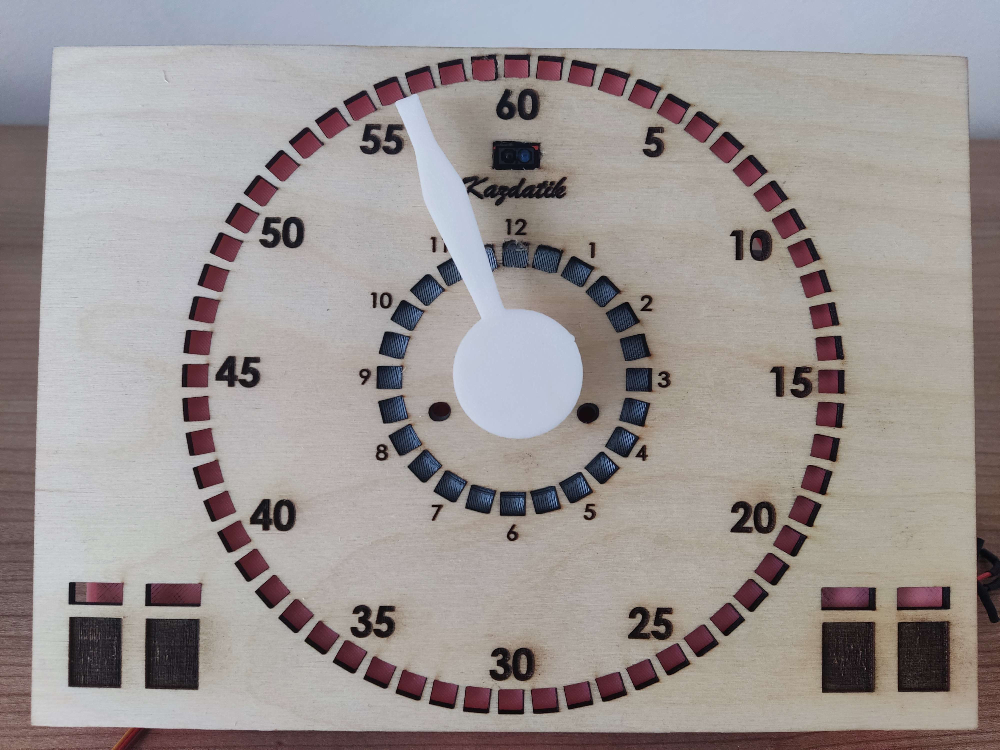
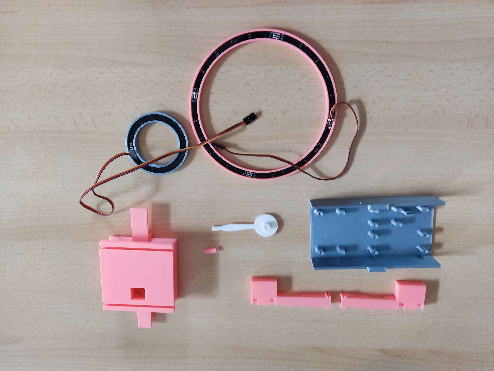
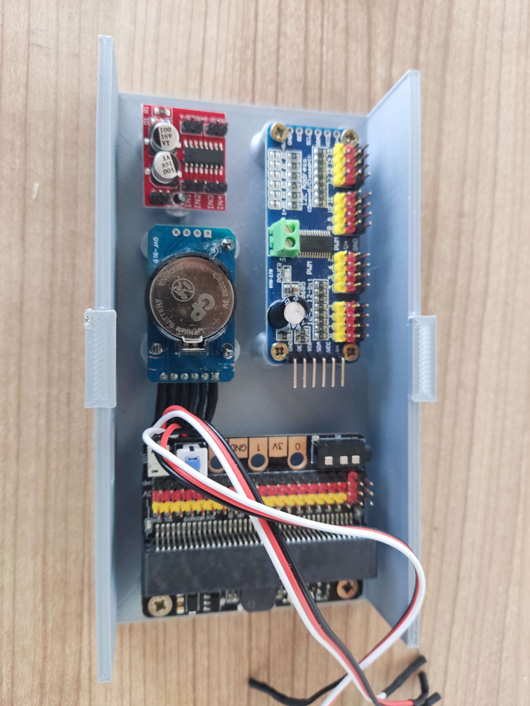
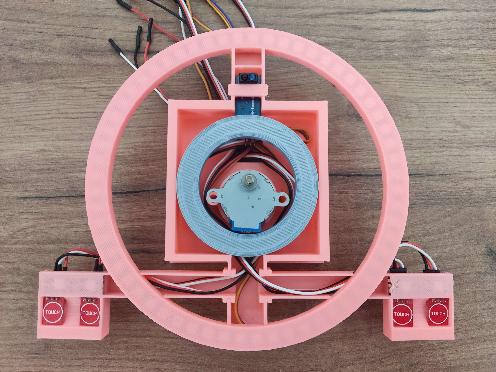

# Robotické hodiny se stojanem na elektroniku

Projekt na vlastní hodiny ovládaný [mikrobitem](https://microbit.org/)

## Jazyky
 

## Potřebné věci před realizací
| Konkrétní položka  | Cena bez dopravy | Doprava |
| ------------- | ------------- | ------------- |
| [Překližka](https://www.cistedrevo.cz/dreveny-tacek-z-preklizky/)  | 19 Kč | 69 Kč |
| [4 dotykové senzory TTP223](https://aliexpress.com/item/32896003343.html) | 43,68 Kč | 26,06 Kč |
| [IR senzor TCRT5000](https://www.aliexpress.com/item/1005004150580253.html) | 14,03 Kč | 26,06 Kč |
| [Led kruh - WS2812B 24](https://www.aliexpress.com/item/4000183166176.html) | 75,30 Kč |18,49 Kč |
| [4× Led kruh - WS2812 5050 RGB LED lampa Panel 1/4](https://www.aliexpress.com/item/1005005161775410.html) | 189,8 Kč | 23,17 Kč |
| [Modulový drive servo motor pro arduino PCA9685](https://www.aliexpress.com /item/1005001621846654.html) | 69,39 Kč | 5,57 Kč |
| [RTC hodiny reálného času s paměťovým modulem pro Arduino DS3231](https://www.aliexpress.com/item/32822420722.html) | 10,92 Kč | 11,36 Kč |
| [KittenBot iobit V2.0 for micro:bit KBC9009A](https://www.aliexpress.com/item/32890235581.html) | 314,11 Kč | zdarma |
| [Modul dvojitého H-můstku MX1508](https://www.aliexpress.com/item/1005001636421978.html) | 9,58 Kč | 5,57 Kč |
| [Mikrobit na ovládání hodin](https://www.aliexpress.com/item/1005005647468917.html) | 458,92 Kč | 134,78 Kč |
| [Led páska 4 adresovatelné kousky WS2812B](https://www.aliexpress.com/item/4001322411818.html) | 43,64 Kč | 23,17 Kč |
| [10× vrutů o průměru 3 mm](https://www.aliexpress.com/item/10000094157430.html)(varianta M3x10) | 10,92 Kč | zdarma |
| [4x vruty o průměru 2 mm](https://www.aliexpress.com/item/1005004247514440.html)(varianta M2x10) | 10,91 Kč | zdarma |
| [4x vruty o průměru 2,2 mm](https://www.aliexpress.com/item/1005004247514440.html)(varianta M2,2x10) | 10,91 Kč | zdarma |
| [2× šrouby M 3×30](https://aliexpress.com/item/1005005469426695.html) | 23,07 Kč | zdarma |
| [2× tavná matice](https://aliexpress.com/item/1005003582355741.html) | 14,93 Kč | 44,78 Kč |

## Vypalování
Nejprve začneme s vypalováním do překližky. Soubor [preklizka](preklizka.sldprt), který převedeme do souboru dxf. Bude to obsahovat přední a zadní rovinu. Abych vám to ulehčil, tak jsem již vám vytoviřil dxf [soubor](Burning/PlyWood.DXF). Byl použit laser [atomstack x7](https://www.atomstack.eu/products/atomstack-x7-pro-50w-laser-engraver-and-cutter). Je potřeba si najít střed překližky a brát v potaz odchylku každé překližky, protože ne každá překližka je stejně velká. Na stránkách našeho výrobce je odchylka 2-5 mm. Po vypálení očištěte kartáčkem.
> **Warning**
> Při vypalování je nutná neustála kontrola a je zakázaný ocházet bez dozoru, jelikož může vzniknout požár. Taktéž doporučuji v místnosti otevřít okna pro snížení akumulace kouře

## Tisknutí
Na tisk je potřeba "překvapivě" 3D tiskárna. Na to jsme využili [prusa mini 2](https://www.prusa3d.com/cs/produkt/stavebnice-3d-tiskarny-original-prusa-mini-2/). Nabízí se nám třeba takový [filament](https://www.alza.cz/gembird-filament-pla-cerna-d4481219.htm). Samozřejmě barvu si vyberte jakou chcete. Je třeba vytisknout všechny části, kterou jsou na obrázku. Doba tisknu nám zabere cca 12 hodin. Podle vyplnění se pak odvíjí hmotnost. V našem případě to vycházelo na cca 152g.

### Konkrétní soubory na tisk
- [Krabička s motorem](ModelsSolidWorks/EngineBox.SLDPRT)
- [2× krabička na pro dotykové senzory](ModelsSolidWorks/BoxForTouchSensors.SLDPRT)
- [Ručička](ModelsSolidWorks/HourHand.SLDPRT)
- [Stojan](ModelsSolidWorks/Stand.SLDPRT)

### Pro lepší manipulaci si stáhněte toto STL
- [Engine Box](STLFile/EngineBox.STL)
- [2× box for touch sensors](STLFile/BoxForTouchSensors.STL)
- [Hand](STLFile/HourHand.STL)
- [Stand](STLFile/Stand.STL)

## Osazení součástek
Základní osazení pro držák:

Základní osazení na překližku:

> **Warning**
> Po nákupu součástek je potřeba zkontrolovat, zda všechny funují, hlavně u dotykových senzoru, jestli dokážou indikovat dotyk.

## Konečné realizování
Nainstalujte všechny vruty, na potřebná místa a natahejte všechny kabely k držáků. Po realizování naštilujte IR senzor
## Cena
Cca nás projekt vyšel na nějakých 2000 Kč (přesněji 1 995,28 Kč).
> **Note**
> Cena je počítána ve **06.06.2023**, takže kvůli rostoucí inflaci, započtení dopravy a geografické poloze se může cena podstatně lišit.
## Autoři

- [@Jan Sebastián Kostlán](https://www.github.com/kostlanovec)
- [@Radek Janeček](https://www.github.com/RadekJanecek)
