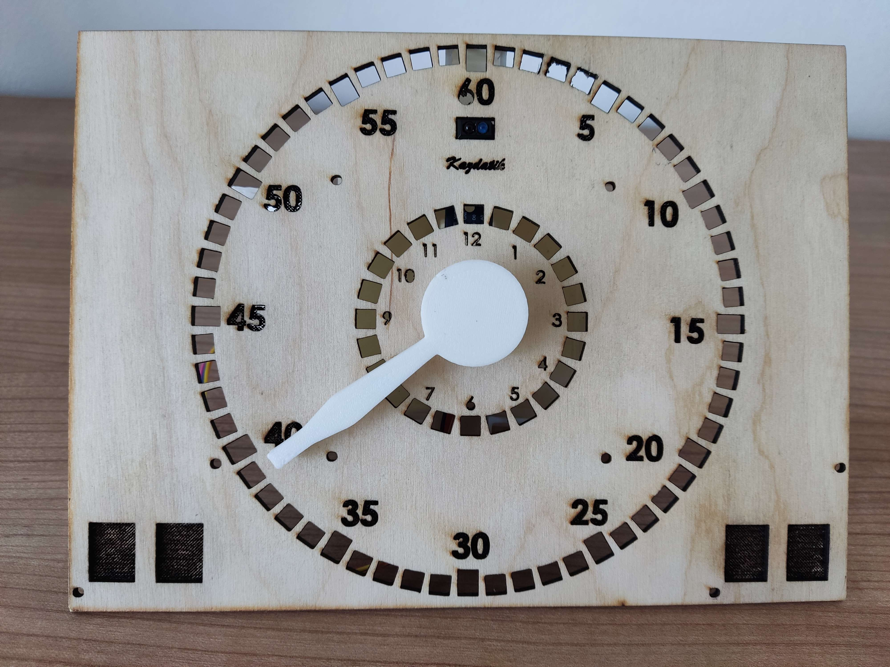
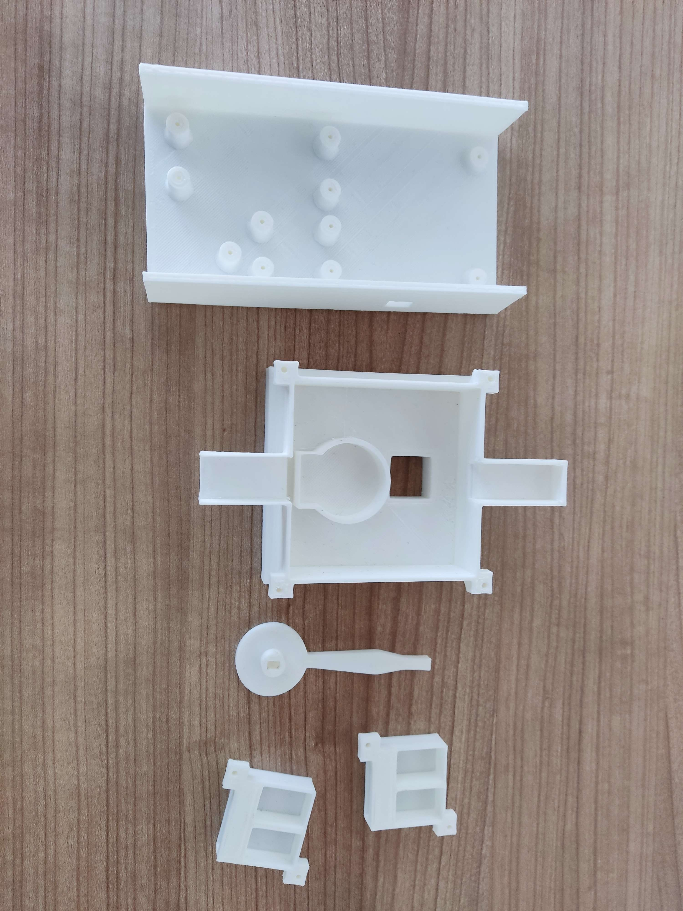
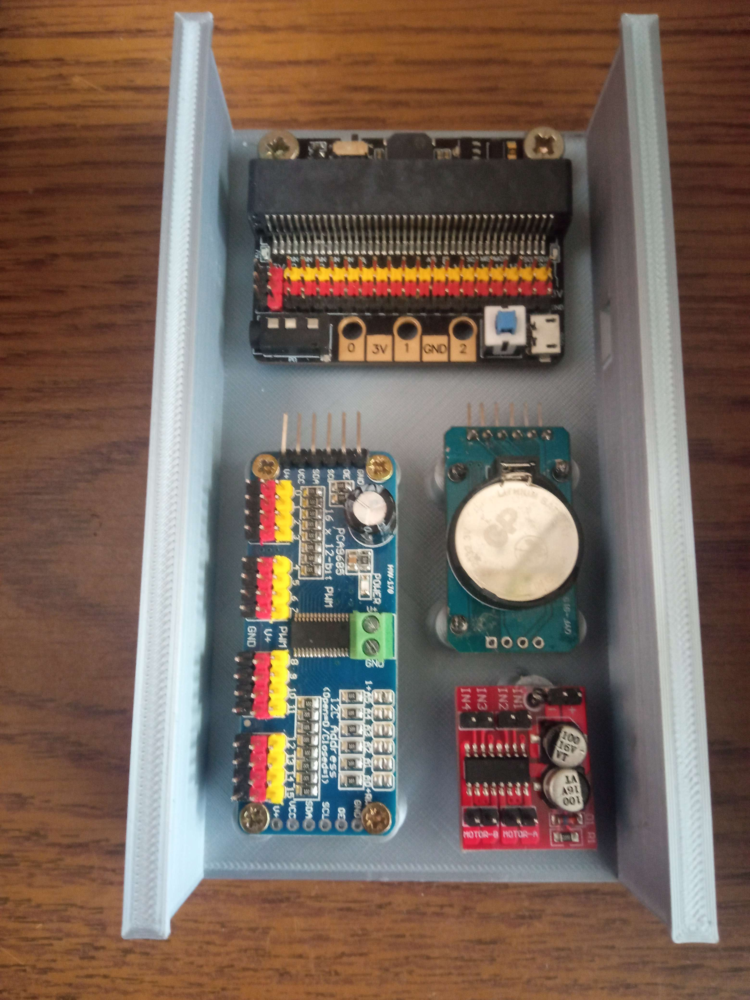
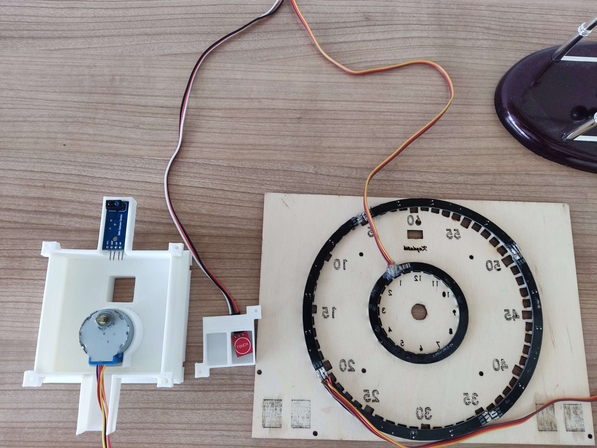

# Robotic clock with electronics stand

Project for a custom clock controlled by [microbit](https://microbit.org/)

## Languages
 

## Things needed before implementation

- [Plywood](https://www.cistedrevo.cz/dreveny-tacek-z-preklizky/)
- [4 touch sensors](https://m.th.aliexpress.com/item/32901141115.html)
- [IR sensor](https://dratek.cz/arduino/1142-infracerveny-opticky-senzor.html)
- [Led ring WS2812b 24](https://dratek.cz/arduino/7693-rgb-led-kruh-24-x-neopixel-ws2812b.html)
- [Led ring WS2812B 60](https://www.vokolo.cz/neopixel-ring/)
- [Modular drive servo motor for arduino](https://dratek.cz/arduino/1686-iic-i2c-modulovy-driver-servo-motoru-pro-arduino-pca9685-16-kanalu-12-bit-pwm.html)
- [RTC real time clock with memory module for Arduino](https://dratek.cz/arduino/1261-rtc-hodiny-realneho-casu-ds3231-at24c32-iic-pametovy-modul-pro-arduino.html)
- [KittenBot iobit V2.0 for micro:bit](https://cz.rs-online.com/web/p/doplnky-bbc-micro-bit/2121789)
- [Modul dvojitého H-můstku MX1508](https://pajenicko.cz/modul-dvojiteho-h-mustku-mx1508)
- [Clock control microbit](https://ruzovka.cz/cs/micro-bit/19683-bbc-micro-bit-v2-21-mikropocitac-pro-vyuku-programovani.html)
- [Led tape 4 addressable bits](https://www.postavrobota.cz/Adresovatelny-LED-pasek-18W-m-WS2812B-RGB-1-66cm-d1666.htm)
- [3D Printing Filament](https://www.alza.cz/gembird-filament-pla-cerna-d4481219.htm)
- [4 2 mm screws](https://www.sroubyonline.cz/spojovaci-material/vruty/univerzalni-vruty/din-95-ocel-zinek-bily)
- [4 2.5 mm screws](https://www.sroubyonline.cz/spojovaci-material/vruty/univerzalni-vruty/zapustne-vruty-pz-ocel-zluty-zinek)(varianta 2,5x10)
- [10 3 mm screws](https://www.sroubyonline.cz/spojovaci-material/vruty/univerzalni-vruty/zapustne-vruty-pz-ocel-zluty-zinek)(varianta 3x10)

## Burning
First, we start with burning into the plywood. The file [plywood](preklizka.sldprt), which we convert to a dxf file. This will contain the front and back planes. To make it easier for you, I've already put it into two files [front](Burnup/preglizkapredni123.dxf) and [back](Burnup/preglizkazadni123.dxf). The laser [atomstack x7](https://www.atomstack.eu/products/atomstack-x7-pro-50w-laser-engraver-and-cutter) was used. You need to find the center of the plywood and take into account the deviation of each plywood, because not every plywood is the same size. On our manufacturer's website the deviation is 2-5 mm. Clean with a brush after firing.
> **Warning**
> Constant checking is necessary during firing and it is forbidden to leave it unattended, as a fire may occur. I also recommend opening the windows in the room to reduce smoke accumulation.

## Printing
A 3D printer is "surprisingly" needed for printing. For this we used [prusa mini 2](https://www.prusa3d.com/cs/produkt/stavebnice-3d-tiskarny-original-prusa-mini-2/) and PLA filament was used. For example, we offered such a [filament](https://www.alza.cz/gembird-filament-pla-cerna-d4481219.htm). Of course you can choose the colour you want. You need to print all the parts you see in the picture. The printing time will take us about 12 hours. The weight is then determined by the filling. In our case it came out to about 152g.

### Konkrétní soubory na tisk
- [Motor box](motorkrabicka.SLDPRT)
- [2× box for touch sensors](ovladanikrabicka.SLDPRT)
- [Hand](rucicka.SLDPRT)
- [Stand](stojan-v6.SLDPRT)
#### Pro lepší manipulaci STL
- [Motor box](motorkrabicka.STL)
- [2× box for touch sensors](ovladanikrabicka.STL)
- [Handle](rucicka.STL)
- [Stand](stojan-v6.STL)

## Component mounting
Basic mounting for the holder:

Basic fitting for plywood:

> **Warning**
> After buying the components, you need to check if they all work, especially for the touch sensors, if they can indicate touch.

## Final implementation
Install all the screws, in the necessary places and pull all the cables to the brackets. After implementation, label the IR sensor
## Price
The project cost us about 2000 (more precisely 1 995,28 CZK).
> **Note**
> The price is calculated in **06.06.2023**, so due to rising inflation, accounting for transport and geographical location, the price may vary significantly.
## Authors

- [@Jan Sebastián Kostlán](https://www.github.com/kostlanovec)
- [@Radek Janeček](https://www.github.com/RadekJanecek)
