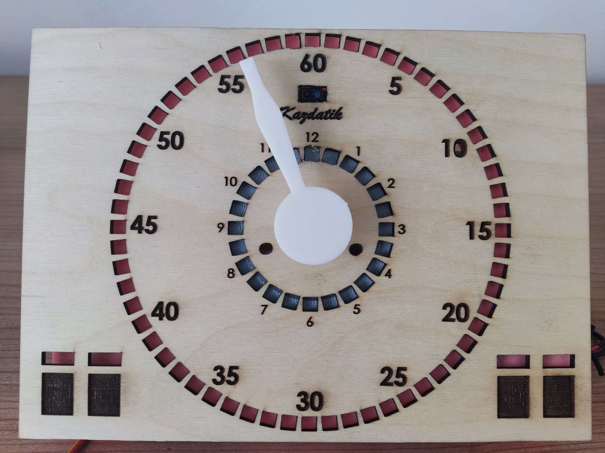
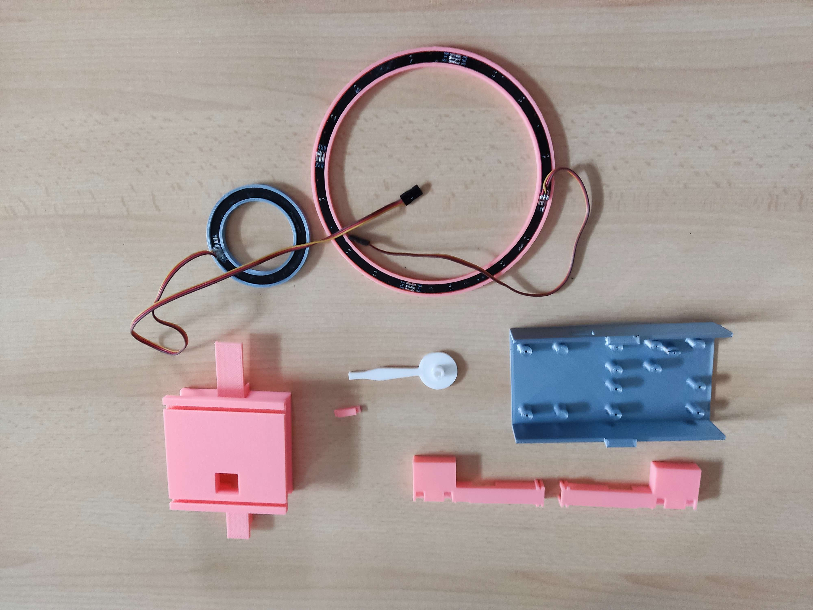

# Robotic clock with electronics stand

Project for a custom clock controlled by [microbit](https://microbit.org/)

## Languages
 

## Things needed before implementation
| Specific item | Price without shipping | Shipping |
| ------------- | ------------- | ------------- |
| [Plywood](https://www.cistedrevo.cz/dreveny-tacek-z-preklizky/)  | $0.84 | $3.07 |
| [4 touch screen TTP223](https://aliexpress.com/item/32896003343.html) | $1.94 | $1.16 |
| [IR sensor TCRT5000](https://www.aliexpress.com/item/1005004150580253.html) | $0.62 | $1.16 |
| [Led ring - WS2812B 24](https://www.aliexpress.com/item/4000183166176.html) | $3.35 | $0.82 |
| [4× Led ring - WS2812 5050 RGB LED lamp Panel 1/4](https://www.aliexpress.com/item/1005005161775410.html) | $8.43 | $1.03 |
| [Modular drive servo motor for arduino PCA9685](https://www.aliexpress.com/item/1005001621846654.html) | $3.09 | $0.25|
| [RTC real-time clock with memory module for aruduino DS3231](https://www.aliexpress.com/item/32822420722.html) | $0.49 |	$0.50 |
| [KittenBot iobit V2.0 for micro:bit KBC9009A](https://www.aliexpress.com/item/32890235581.html) | $13.98 |	free |
| [Module double H-bridge MX1508](https://www.aliexpress.com/item/1005001636421978.html) | $0.43	| $0.25 |
| [Microbit to control the clock](https://www.aliexpress.com/item/1005005647468917.html) | $20.40	|$5.99 |
| [Led strip 4 addressable pieces WS2812B](https://www.aliexpress.com/item/4001322411818.html) | $1.94 | $1.03 |
| [10× screws with a diameter of 3 mm](https://www.aliexpress.com/item/10000094157430.html)(M3x10) | $0.49	| free|
| [4x screws with a diameter of 2 mm](https://www.aliexpress.com/item/1005004247514440.html)(M2x10) | $0.49 | free |
| [4x screws with a diameter of 2,2 mm](https://www.aliexpress.com/item/1005004247514440.html)(M2,2x10) | $0.49 | free |
| [2× screws M 3×30](https://aliexpress.com/item/1005005469426695.html) | $1.03	 | free|
| [2× melting nuts](https://aliexpress.com/item/1005003582355741.html) | $0.66|	$1.99 |

## Burning
First we start with burning into the plywood. I've already created a dxf [file](Burning/PlyWood.DXF). The laser [atomstack x7](https://www.atomstack.eu/products/atomstack-x7-pro-50w-laser-engraver-and-cutter) was used. You need to find the center of the plywood and take into account the deviation of each plywood, because not every plywood is the same size. On our manufacturer's website the deviation is 2-5 mm. Clean with a brush after firing.
> **Warning**
> Constant checking is necessary during firing and it is forbidden to leave it unattended, as a fire may occur. I also recommend opening the windows in the room to reduce smoke accumulation.

## Printing
"Surprisingly" a 3D printer is needed for printing. For this we used [prusa mini 2](https://www.prusa3d.com/cs/produkt/stavebnice-3d-tiskarny-original-prusa-mini-2/). For example, we offer such a [filament](https://www.alza.cz/gembird-filament-pla-cerna-d4481219.htm). Of course, choose the color you want. You need to print all the parts you see in the picture. The printing time will take us about 12 hours. The weight is then determined by the filling. In our case it came out to about 152g.

### Specific files to print in STL format
- [Engine Box](STLFile/EngineBox.STL)
- [2× box for touch sensors](STLFile/BoxForTouchSensors.STL)
- [Hand](STLFile/HourHand.STL)
- [Stand](STLFile/Stand.STL)

## Fitting components
Basic fitting for the holder:

Basic fitting on plywood:

> **Warning**
> After buying the components, you need to check if they all work, especially for the touch sensors, if they can indicate touch.

## Final implementation
Install all the screws, in the necessary places and pull all the cables to the brackets. After implementation, label the IR sensor
## Price
The project cost us about $76 (more precisely $75.92).
> **Note**
> The price is calculated in **06.06.2023**, so due to rising inflation, accounting for transport and geographical location, the price may vary significantly.
## Authors

- [@Jan Sebastian Kostlán](https://www.github.com/kostlanovec)
- [@Radek Janeček](https://www.github.com/RadekJanecek)
