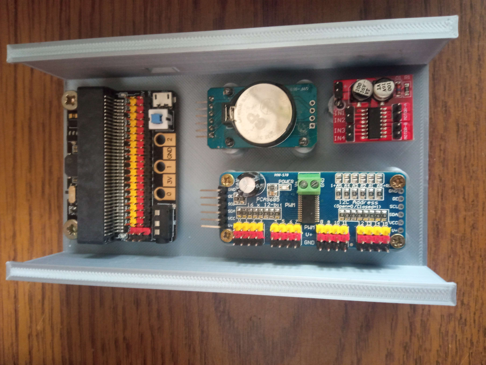

# Robotické hodiny se stojanem na elektroniku

Projekt na vlastní hodiny ovládaný [mikrobitem](https://microbit.org/)

## Jazyky

## Potřebné věci před realizací

- [Překližka](https://www.cistedrevo.cz/dreveny-tacek-z-preklizky/)
- [4 dotykové senzory](https://m.th.aliexpress.com/item/32901141115.html?gatewayAdapt=Pc2Msite)
- [IR senzor](https://dratek.cz/arduino/1142-infracerveny-opticky-senzor.html)
- [Led kruh WS2812b 24](https://dratek.cz/arduino/7693-rgb-led-kruh-24-x-neopixel-ws2812b.html)
- [Led kruh WS2812B 60](https://www.vokolo.cz/neopixel-ring/)
- [Modulový drive servo motor pro arduino](https://dratek.cz/arduino/1686-iic-i2c-modulovy-driver-servo-motoru-pro-arduino-pca9685-16-kanalu-12-bit-pwm.html)
- [RTC hodiny reálného času s paměťovým modulem pro Arduino](https://dratek.cz/arduino/1261-rtc-hodiny-realneho-casu-ds3231-at24c32-iic-pametovy-modul-pro-arduino.html)
- [KittenBot iobit V2.0 for micro:bit](https://cz.rs-online.com/web/p/doplnky-bbc-micro-bit/2121789)
- [Modul dvojitého H-můstku MX1508](https://pajenicko.cz/modul-dvojiteho-h-mustku-mx1508)
- [Mikrobit na ovládání hodin](https://ruzovka.cz/cs/micro-bit/19683-bbc-micro-bit-v2-21-mikropocitac-pro-vyuku-programovani.html)
- [Led páska 4 adresovatelné kousky](https://www.postavrobota.cz/Adresovatelny-LED-pasek-18W-m-WS2812B-RGB-1-66cm-d1666.htm)
- [Filament na 3D tisk](https://www.alza.cz/gembird-filament-pla-cerna-d4481219.htm)

## Vypalování
Nejprve začneme s vypalováním do překližky. Soubor [preklizka](preklizka.sldprt), který převedeme do souboru dxf. Bude to obsahovat přední a zadní rovinu. Abych vám to ulehčil, tak jsem vám to již do dvou souboru [predni](Vypalovani/preklizkapredni123.DXF) a [zadni](Vypalovani/preklizkazadni123.dxf). Byl použit laser [atomstack x7](https://www.atomstack.eu/products/atomstack-x7-pro-50w-laser-engraver-and-cutter). Je potřeba si najít střed překližky a brát v potaz odchylku každé překližky, protože ne každá překližka je stejně velká. Na stránkách našeho výrobce je odchylka 2-5 mm. Po vypálení očištěte kartáčkem.
> **Warning**
> Při vypalování je nutná neustála kontrola a je zakázaný ocházet bez dozoru, jelikož může vzniknout požár. Taktéž doporučuji v místnosti otevřít okna pro snížení akumulace kouře

## Tisknutí
Na tisk je potřeba "překvapivě" 3D tiskárna. Na to jsme využili [prusa mini 2](https://www.prusa3d.com/cs/produkt/stavebnice-3d-tiskarny-original-prusa-mini-2/) a byl využit PLA filament. Nabízí se nám třeba takový [filament](https://www.alza.cz/gembird-filament-pla-cerna-d4481219.htm). Samozřejmě barvu si vyberte jakou chcete. Je třeba vytisknout všechny části, kterou jsou na obrázku. Doba tisknu nám zabere cca 12 hodin.

### Konkrétní soubory na tisk
- [Krabička s motorem](motorkrabicka.SLDPRT)
- [2× krabička na pro dotykové senzory](ovladanikrabicka.SLDPRT)
- [Ručička](rucicka.SLDPRT)

## Osazení součástek
Základní osazení máte zde:

## Cena
Cca nás projekt vyšel na nějakých 1000 korun s mikrobitem a bez něj na nějakých 500 korun bez dopravy
> **Note**
> Cena je počítána ve **03.06.2023**, takže kvůli rostoucí inflaci, započtení dopravy a geografické poloze se může cena podstatně lišit.

## Seznam všech dostupných souboru

## Authors

- [@Jan Sebastián Kostlán](https://www.github.com/kostlanovec)
- [@Radek Janeček](https://www.github.com/RadekJanecek)
